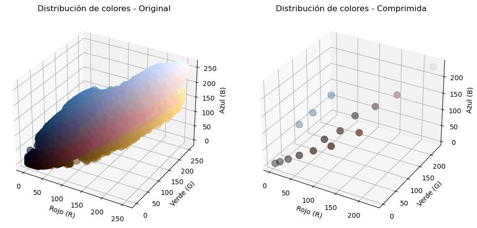
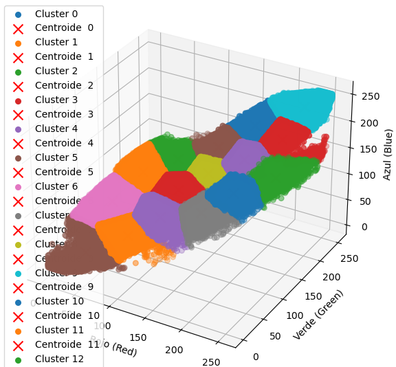

# K-Means Image Compressor
Using the Machine Learning algorithm K-Means, applies clustering to reduce the number of colors in an image, effectively compressing it while preserving visual quality.  

This project demonstrates the power of clustering algorithms in image processing, optimizing storage while maintaining a visually recognizable output.   

## How to use
* Select an image from your storage
* Specify a value for K, which is the amount of colours for k-means to reduce the image
* Press ***Compress Image***, the compressed image will display in the right side

> After compression, the size of the compressed image displayed above is less than the original,
k-means reduce the amount of colors using a indexed color palette format
 

  

## What shows the graphics?
| Graphic               | What does display? |
| --------------------- | ---------- | 
| Show Palette          | Quantity of colours in the original image and compressed image   
  
 |
| Show Graphic Color    |   
  
 |
| Show Clusters         |   
  
 |
